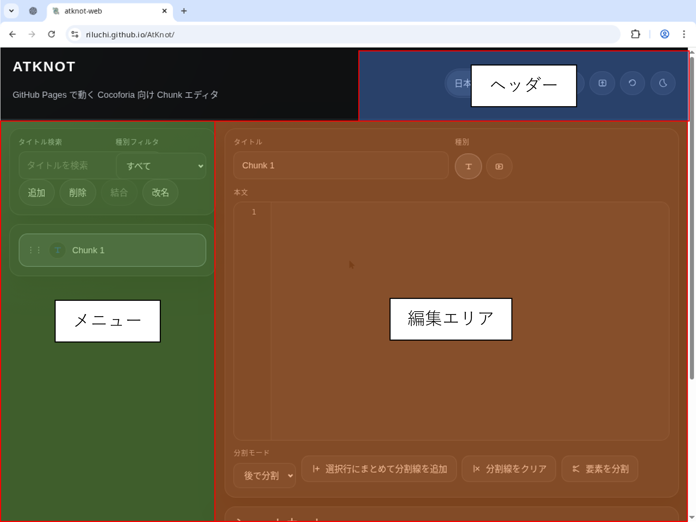
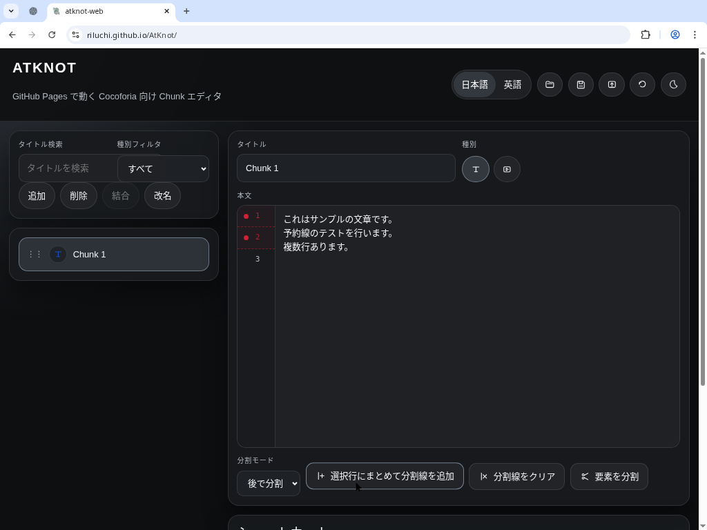
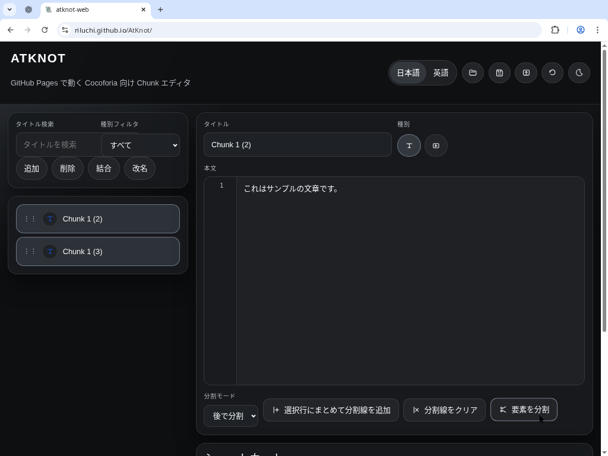
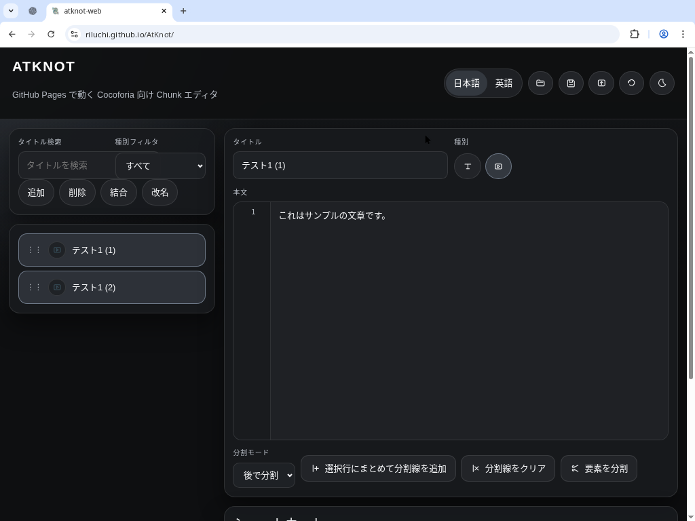
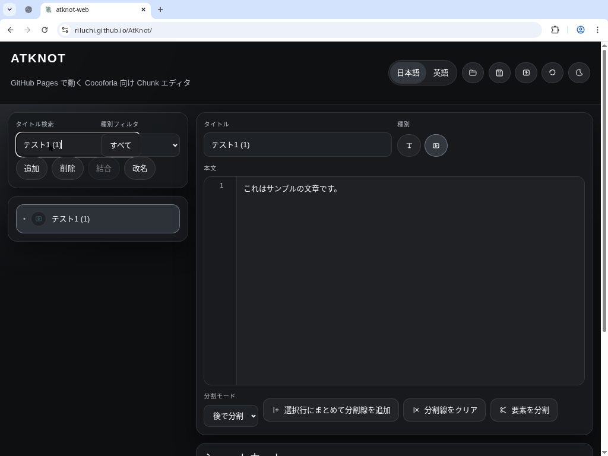
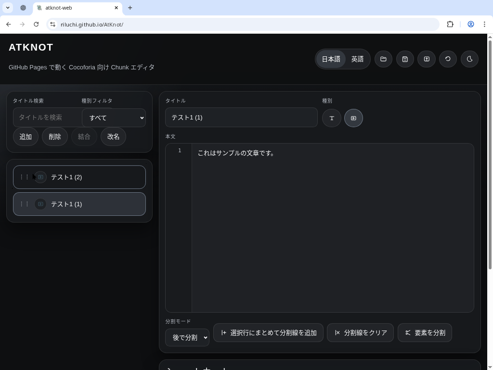
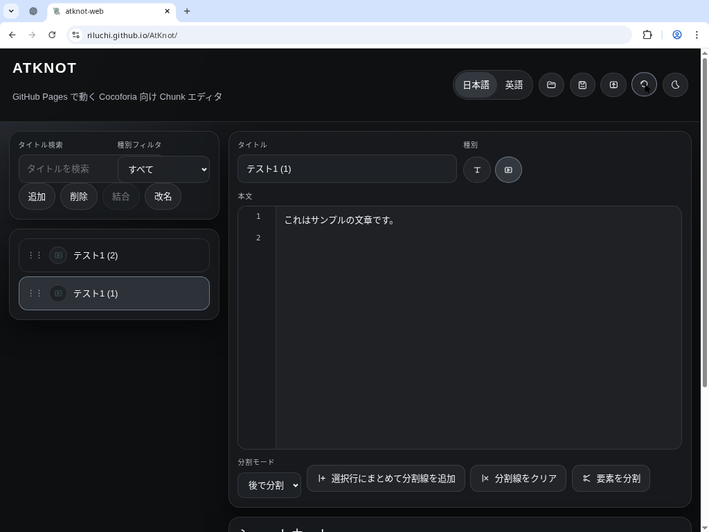

# AtKnot-Web 利用手順書

以下は Cocoforia 用チャンクエディタ **AtKnot** の基本的な使い方となります。

## 1. 画面構成の概要

AtKnot は大きく以下の 3 つの領域から構成されています。

- **ヘッダー（画面上部）**：言語切替ボタン（日本語/英語）と、作業データの読み込み・保存、cocoforia部屋データ出力、操作履歴を戻すボタンがあります。
- **左側メニュー**：チャンクの一覧を管理する領域です。タイトル検索欄、種別フィルタ、追加/削除/結合/改名ボタンがあります。チャンクごとにカードが並び、ドラッグで並び替えや複数選択ができます。
- **右側編集エリア**：選択したチャンクの編集画面です。タイトル欄、種別切替（テキスト/シーン）ボタン、本分編集欄、分割モードの設定と分割線の操作ボタンが並びます。

参考：画面全体の構成

## 2. 文章に分割線を引く

1. 右側の **本文編集欄** に文章を入力します。
2. 単体選択したい場合
   1. 分割したい行の左側をクリックします
   2. 赤い丸印の「分割線」が付きます。

3. 複数選択したい場合
   1. 分割したい行をドラッグで選択します（Shift キーを使うと複数行を選択できます）。
   2. 本文欄の下にある `選択行にまとめて分割線を追加` ボタン（“┼”アイコン）をクリックすると、選択した行の左側に赤い丸印の「分割線」が付きます。

分割線が付いた状態

## 3. 分割線で文章を分割する

分割線を付けたら、編集欄下部の `要素を分割` ボタンをクリックします。赤い丸印の位置で本文が分割され、左側メニューに複数のチャンクとして追加されます。

分割後はチャンクが複数に分かれていることが確認できます。

## 4. テキストとシーンの切り替え

各チャンクには「テキスト」「シーン」の 2 種別があります。
※「テキスト」「シーン」はそれぞれcocoforiaの「シナリオテキスト」「シーン」として出力します。

右側編集エリアの **タイトル欄右側** に丸いアイコンが 2 つ並んでいます。

- 左側の **T** アイコン：テキストモード。
- 右側の **画面** アイコン：シーンモード。

どちらかをクリックすると、そのチャンクの種別が切り替わります。チャンク一覧のアイコンもそれに合わせて変わります。

## 5. 左メニューの名称変更

1. 名称を変更したいチャンクを左メニューから選択します。
2. 左メニュー上部の `改名` ボタンをクリックします。（またはF2押下）
3. ダイアログが表示されるので、新しいタイトルを入力して `OK` を押します。

名称変更後は左メニューの表示も更新されます。

## 6. 左メニューで複数のチャンクを選択する

- チャンクを複数まとめて操作したい場合は、`Ctrl` キー（Mac の場合は `⌘` キー）を押しながらクリックして複数のカードを選択します。選択状態の見た目は一つずつ切り替わりますが、`結合` ボタンを押すと複数選択が反映されます。
- 範囲内のチャンクを選択する場合は、先頭のチャンクをクリックして選択してから選択末尾のチャンクを`Shift`キーを押しながらクリックすることで先頭-末尾すべてのチャンクを複数選択できます。

## 7. 左メニューの検索機能

左メニュー上部の **タイトル検索** ボックスにキーワードを入力すると、入力文字列に一致するチャンクのみが表示されます。検索条件をクリアすると全てのチャンクが再び表示されます。
また、種別フィルタを設定することで、シナリオテキストのみや、シーンのみの表示などができます。

## 8. 左メニューのチャンクの並び替え

チャンクカードの左側にある縦三点アイコンをドラッグすると、チャンクの表示順を自由に変更できます。ドラッグして上へ移動すると順序が入れ替わります。

## 9. 戻る操作（Undo）

編集操作を取り消す方法は 2 つあります。

- **Ctrl+Z (⌘+Z)** を押すと直前の編集を取り消します。
- ヘッダーにある丸い矢印（戻る）アイコンをクリックしても同じく undo 操作が実行されます。
  

## 11. 作業データを保存する

現在の作業内容を保存する場合は、ヘッダーの **フロッピーディスクのようなアイコン**（保存アイコン）をクリックします。（もしくはCtrl + S）ファイルが自動的にダウンロードされ、JSON ファイルとして保存されます。必要に応じてファイル名を変更してください。

## 10. 作業データを開く

既存の作業データ（JSON 形式）を読み込む場合は、ヘッダーの **フォルダーアイコン** をクリックします。ファイル選択ダイアログが開くので、対象のファイルを選んで `Open` を押してください。読み込んだデータは左メニューに反映されます。

## 12. 部屋データを出力する

作成したチャンクデータをcocoforiaの部屋に取り込ませることができます。
ただし、Cocoforia 用の部屋データを生成するには、Cocoforiaの課金サービス`Cocoforia PRO`に加入し、部屋データのエクスポートができなければ利用できません。
次に手順を示します。

1. Cocoforiaにて、新規で部屋を立てます
2. 部屋 > ルーム設定 > ルームデータ にアクセスし、ルームデータのエクスポートから`エクスポート`をクリックしてください。zipファイルをダウンロードするはずです
3. AtKnotにて、ヘッダーの **箱から矢印が出ているような出力アイコン** をクリックします。
4. ファイル選択画面が表示されるので、先ほどダウンロードしたzipファイルを選択します
5. しばらく待機すると、zipファイルがダウンロードされます
6. zipファイルをcocoforiaの部屋のインポートに利用ください
7. シナリオテキスト、シーンに、AtKnotで編集したデータが入っていることを確認できます
